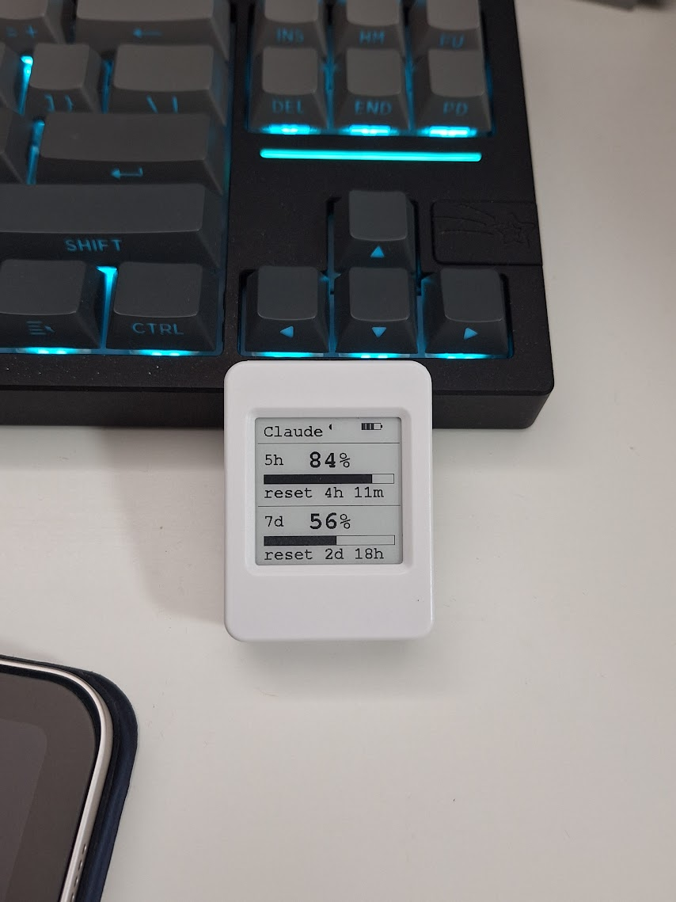
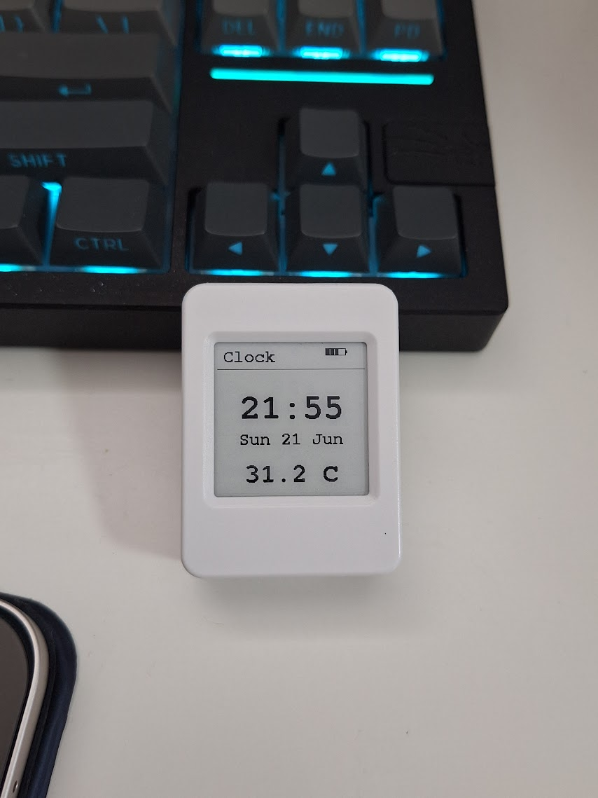

# ClaudeMeterEpaper

> # ⚠️ DISCLAIMER — THIS IDEA IS STOLEN ⚠️
>
> **The entire concept is shamelessly lifted from
> [Clawdmeter](https://github.com/HermannBjorgvin/Clawdmeter) by Hermann
> Björgvin.** The "show your Claude usage on a tiny desk gadget" idea, the BLE
> GATT contract, and the Python daemon are all theirs — I just re-skinned it for
> an e-paper panel. All credit for the original goes to them. Go star their repo.
> This project would not exist without it.

A desk companion for the **Waveshare ESP32-S3-ePaper-1.54** (200×200 B/W,
SSD1681) that shows your Claude Code usage and a clock on e-paper. It's an
e-paper take on
[Clawdmeter](https://github.com/HermannBjorgvin/Clawdmeter) and reuses that
project's Python daemon **unmodified** by speaking its BLE GATT contract.

Two modes, cycled with the **PWR** button:

| Mode | Shows |
|------|-------|
| **Claude** | 5h and 7d rate-limit utilization (%, bar, reset countdown) + a daemon-alive dot |
| **Clock** | `HH:MM` (RTC-backed, NTP-corrected), date, and SHTC3 temperature |

Every screen carries a 4-segment battery icon (top-right) that animates a
left-to-right sweep while charging.

## Buttons

| Button | Action |
|--------|--------|
| **PWR** (GPIO18) | Click → cycle mode (Claude ↔ Clock) |
| Serial `p` | Restart BLE advertising |

## Why a separate repo (not a fork of Clawdmeter)

- **Different hardware.** Clawdmeter targets AMOLED/LVGL boards; this is
  e-paper (GxEPD2, slow full-refresh, no animation). Almost no firmware is
  shared.
- **License hygiene.** Clawdmeter bundles proprietary fonts and a copyrighted
  mascot and ships no LICENSE. This repo is firmware-only and just *runs* their
  daemon — no redistribution, no entanglement.

## Architecture

```
Clawdmeter daemon (their repo, run as-is)        this firmware (ESP32-S3)
  poll Anthropic rate-limit headers  ──BLE write──▶  parse JSON ─▶ draw e-paper
```

Firmware is split into small single-responsibility classes under `src/`:

| File | Responsibility |
|------|----------------|
| `main.cpp` | Orchestration: mode FSM, timers, glue |
| `Pins.h` | All GPIO + I2C address constants |
| `DisplayUi.{h,cpp}` | E-paper panel + every screen render |
| `ClawdBle.{h,cpp}` | NimBLE peripheral (the daemon's GATT contract) |
| `UsageData.h` | Usage payload struct + JSON parser |
| `BatteryGauge.{h,cpp}` | ADC battery %, charging heuristic |
| `TempSensor.{h,cpp}` | SHTC3 temperature (I2C) |
| `Rtc.{h,cpp}` | PCF85063 battery-backed RTC (I2C) |
| `TimeSync.{h,cpp}` | System clock: seed from RTC on boot, WiFi NTP sync, write back to RTC |
| `Buttons.{h,cpp}` | Debounced PWR click |

### BLE GATT contract (identical to Clawdmeter)

| Item | Value |
|------|-------|
| Device name | `Clawdmeter` (in scan-response data) |
| Service | `4c41555a-4465-7669-6365-000000000001` |
| RX char (daemon → device, write) | `…0002` |
| REQ char (device → daemon, notify) | `…0004` |

Payload written by the daemon to the RX char:

```json
{"s":42,"sr":118,"w":7,"wr":9320,"st":"allowed","ok":true}
```

`s`/`w` = 5h/7d utilization %; `sr`/`wr` = minutes to reset; `st` = status;
`ok` = poll succeeded.

## Pin map (Waveshare ESP32-S3-ePaper-1.54)

| Signal | GPIO | | Signal | GPIO |
|---|---|---|---|---|
| EPD SCK | 12 | | EPD DC | 10 |
| EPD MOSI | 13 | | EPD RST | 9 |
| EPD CS | 11 | | EPD BUSY | 8 |
| EPD PWR gate | 6 (LOW=on) | | Battery ADC | 4 (÷2) |
| BOOT button | 0 | | PWR button | 18 |
| VBAT power latch | 17 (HIGH=on) | | I2C SDA / SCL | 47 / 48 |

I2C devices: SHTC3 temp `0x70`, PCF85063 RTC `0x51`, ES8311 codec `0x18`.

## Build / flash

Requires [PlatformIO](https://platformio.org/).

```bash
cp src/wifi_config.example.h src/wifi_config.h   # then edit your WiFi + TZ
pio run                                          # build
pio run -t upload                                # flash (auto-detect port)
pio device monitor -b 115200
```

`wifi_config.h` is gitignored, so your credentials never get committed. Leave
`WIFI_SSID` empty to skip WiFi; the clock will show **WiFi down**.

## Run the daemon (drives the Claude usage screen)

From a clone of the [Clawdmeter](https://github.com/HermannBjorgvin/Clawdmeter)
repo:

```bash
cd Clawdmeter/daemon
pip install bleak httpx
python3 claude_usage_daemon.py
```

It reads your Claude Code OAuth token (macOS Keychain `Claude Code-credentials`,
or `~/.claude/.credentials.json`), polls the Anthropic rate-limit headers, finds
the BLE device named `Clawdmeter`, and pushes a payload every ~60 s. On macOS,
grant Bluetooth permission to the terminal on first run. For auto-start at login,
use Clawdmeter's `install-mac.sh` (installs a launchd agent).

## Testing

Expected serial at boot (115200), with the daemon running:

```
rtc: seeded 2026-06-21 01:06:33
wifi: connecting to <ssid>.....
ntp: 2026-06-21 01:06 (rtc updated)
ready (press 'p' to restart advertising)
advertising as Clawdmeter
searching for daemon...
connected
payload: {"s":19,"sr":294,"w":14,"wr":5214,"st":"allowed","ok":true}
```

The clock now reads from the battery-backed **PCF85063 RTC** first, so time is
correct **immediately on boot with no WiFi** and **survives a power-off**. NTP
(every 10 min, and on BOOT long-hold) corrects the clock and writes the result
back to the RTC. First-ever boot on a board whose RTC was never set logs
`rtc: no valid time (will wait for NTP)` until the first NTP sync seeds it.

On the panel: boot shows `waiting BLE...`; once payloads arrive the Claude
screen shows the 5h/7d blocks with a filled daemon-alive dot. PWR cycles
between the Claude and Clock screens. On the Clock screen BOOT refreshes the
time and flips the bottom reading between temperature and humidity.

**Every render is a partial update — the panel never full-flashes during normal
use.** Whole-screen redraws (`showStatus`/`showUsage`/`showClock`) draw into a
full-window *partial* refresh via `beginFrame()`; the per-component updates
(battery icon, clock `HH:MM`, temp/humidity line) are small partial windows.
To stop ghosting building up, every 10th whole-screen redraw — and the Clock
screen's 30-min tick — forces one true full refresh (the only time it flashes).

The driver emits `_Update_Part : ...` for partial refreshes and `_Update_Full`
only for those periodic ghost cleans, e.g.:

```
_Update_Part : 308000
_Update_Part : 308000
```

## Resource usage

Build: `pio run`, env `esp32-s3-epaper-154`, ESP32-S3 (8 MB flash), Arduino
(arduino-esp32 3.3.8 / NimBLE-Arduino 2.x).

| Segment | Used | Total | % |
|---------|------|-------|---|
| RAM | 59432 B | 327680 B | 18.1% |
| Flash | 1305929 B | 3342336 B | 39.1% |

## Known limitations

- **Charging detection is a heuristic.** The board exposes no charge-status
  GPIO, so `BatteryGauge::isCharging()` infers it from cell voltage (≥4.15 V).
  It can't distinguish a full battery on USB from one mid-charge.
- **PWR button polarity** is assumed active-low; the firmware prints
  `PWR pin -> N` on each edge so you can confirm/flip it for your unit.
## Hardware Pictures





## Credits & license

- Daemon and BLE contract: [Clawdmeter](https://github.com/HermannBjorgvin/Clawdmeter)
  by Hermann Björgvin — run as-is, not redistributed here.
- Libraries: GxEPD2, Adafruit GFX, ArduinoJson, NimBLE-Arduino.

Released under the MIT License (see `LICENSE`).
